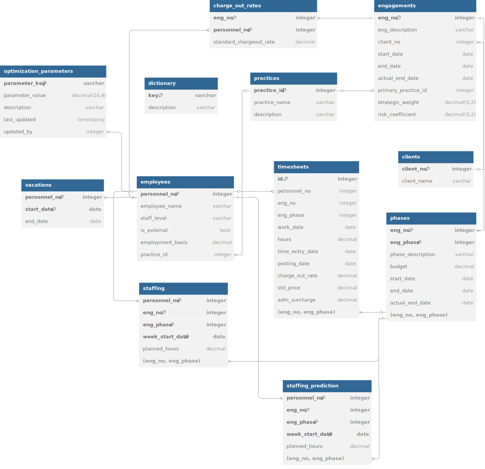

# Predictive Resource Optimization Platform (PROP) - KPMG Case Challenge Submission

<div align="center">

[](https://www.python.org/)
[](https://powerbi.microsoft.com/)
[](https://www.microsoft.com/sql-server)
[](https://www.microsoft.com/excel)

</div>

## 🏆 Team 7

| Team Member | GitHub     | Linkedin                                                                 | Background                                                                               |
| ----------- | ---------- | ------------------------------------------------------------------------ | ---------------------------------------------------------------------------------------- |
| Minh        | @vibqetowi | [hminh-software-eng](https://www.linkedin.com/in/hminh-software-eng)        | Software Engineering, previous experience in software development and project management |
| Carter      | @carterj-c | [cartercameronfina](https://www.linkedin.com/in/cartercameronfina)          | Previously Mechanical Engineering now in Finance, previous experience in aerospace engineering                     |
| Casey       | @cassius   | [casey-jussaume](https://www.linkedin.com/in/casey-jussaume)                | Finance & accounting, previous experience in financial modeling and research             |
| Romero      | @geekpapi  | [romero-p-faustin](https://www.linkedin.com/in/romero-p-faustin-96106a179/) | Economics & Computer Science, previous experience in data analysis                       |

## 🎯 Project Overview

Team 7 is pleased to present its submission for the KPMG case challenge: the **Predictive Resource Optimization Platform (PROP)** focusing on consulting assignment optimization. While our backgrounds are primarily in engineering, economics, project management, and finance rather than consulting, we've leveraged our technical expertise and project coordination experience to develop a solution that addresses resource allocation challenges common to professional services organizations. Our solution is a production-ready dashboard designed to implement enhanced earned value management (EVM) principles to optimize resource allocation across engagements.

This dashboard is specifically engineered to address critical business needs prevalent in consulting practices:

- Optimizing consultant utilization
- Minimizing consultant bench time
- Maintaining engagement schedules effectively
- Maximizing profitability through efficient resource allocation

### Platform Showcase


*(A preview of the main dashboard interface)*

## 🌟 Key Capabilities

The key business outcomes from this predictive dashboard solution are:

- True visibility on engagement profitability
- Instant financial interpretations (VEC, Burn, SPI)
- Enhanced client satisfaction through consistently meeting deadlines
- Better work-life balance through realistic capacity planning
- Earned Value Management (EVM) metrics calculation (SPI, EV, PV)
- Consultant allocation optimization algorithm
- engagement performance visualization for clear insights
- Resource utilization tracking (Benching, Capacity Utilization)
- Schedule and cost variance monitoring to maintain engagement control
- Predictive engagement completion forecasting
- Vacation tracking and integration to prevent resource allocation conflicts and ensure realistic capacity planning

## 💼 Business Objectives and Optimization Targets

Our solution focuses on key business metrics that drive profitability and efficiency in consulting organizations: maximizing both budget utilization and maintaining target chargeout rates (captured by VEC), while ensuring timely delivery (SPI) and optimal resource usage (Benching Rate, Capacity Utilization Rate).

### Value Extraction Coefficient (VEC)

Traditional project management metrics often fail to capture the dual financial objectives of consulting: utilizing the budget (not leaving money on the table) while maximizing the value realized from chargeout rates and resource mix. Our Value Extraction Coefficient (VEC) provides executives with a consolidated measure of *financial realization efficiency* relative to the budget for an engagement or phase.

The VEC is calculated as follows (shown for a specific phase $ph$):

$$`
\text{VEC}_{ph} = \frac{1}{\text{BAC}_{ph}} \times \sum_{i=1}^{n} \left[ \text{AC}_i \times d_i \times ea_j \times eo_j \right]
`$$

Where:

* $` \text{BAC}_{ph} `$: Budget At Completion for phase $ph$. The $ \frac{1}{\text{BAC}_{ph}} $ term normalizes the extracted value against the phase budget baseline. (VEC can also be calculated at the engagement level).
* $ \sum_{i=1}^{n} $: Summation over all individual financial transactions $ i $ (typically timesheet entries) contributing to the phase's actual cost up to the point of measurement.
* $ \text{AC}_i $: Actual Billed Amount (or Cost equivalent) for transaction $ i $.
* $ d_i $: Rate Efficiency Factor for transaction $ i $, measuring how the actual chargeout rate used compares to the standard rate for the consultant $ j $ associated with transaction $ i $.
  $$
  d_i = \frac{\text{Chargeout}_i}{\text{StandardChargeout}_j}
  $$
* $ ea_j $: External Adjustment Factor for consultant $ j $ (e.g., 1.0 for internal, 0.9 for external).
  $$
  ea_j = 1 - 0.1 \times \text{isExternal}_j
  $$
* $ eo_j $: Onboarding/New Hire Adjustment Factor for consultant $ j $ (e.g., 1.0 for experienced, 0.8 for new).
  $$
  eo_j = 1 - 0.2 \times \text{isNew}_j
  $$

#### Interpreting Financial Health (using VEC and Burn)

Budget Burn for a phase is calculated as $\text{Burn}_{ph} = \frac{\sum AC_i}{\text{BAC}_{ph}}$. VEC and Burn provide a nuanced view of financial health:

|                     | **VEC > Burn** (Premium Realization) | **VEC ≈ Burn** (Standard Realization) | **VEC < Burn** (Value Dilution) |
| :------------------ | :----------------------------------------- | :------------------------------------------- | :------------------------------------ |
| **Burn < 1**  | Excellent                                  | On Track                                     | Warning                               |
| **Burn ≈ 1** | Excellent                                  | On Track                                     | Warning                               |
| **Burn > 1**  | Ambiguous                                  | Critical                                     | Critical                              |

**Interpretation Notes:**

* **Excellent:** High efficiency, within or at budget. Strong performance.
* **On Track:** Standard efficiency, within or at budget. Meeting expectations.
* **Warning:** Inefficiency (dilution) detected, even if currently within budget. Potential future problems if trend continues.
* **Ambiguous:** Over budget, but spend appears efficient. Needs investigation: Is the high efficiency justifying the cost (e.g., scope change, premium value), or masking poor cost control?
* **Critical:** Over budget combined with standard or poor efficiency. Clear problem with cost control and/or value realization. Requires immediate attention.

### Resource Optimization

Our solution addresses the core optimization challenge facing consulting organizations by recommending optimal consultant assignments:

$$
\max_{A} \sum_{en \in EN} w_{en} \times r_{en} \times (\alpha \times \text{SPI}_{en} + \beta \times \text{VEC}_{en}) - \sum_{c\in C, en \in EN, w \in W}\text{pse} \times \text{is\_switch}_{c,en,w}
$$

Where $A$ represents the assignment matrix (consultant $c$, engagement $en$, hours in week $w$). The optimization seeks the assignment $A$ that maximizes this weighted sum of performance indicators across all engagements $EN$, penalized by the cost (`pse`) of switching consultants between engagements.

Subject to critical business constraints:

- $\text{SPI}_{en} \ge 0.85$ for all engagements $en$ (preventing schedule slippage).
- $\bigl|\text{VEC}_{en} - \text{Burn}_{en}\bigr| \le 0.15$ for all engagements $en$ (ensuring adequate value extraction).
- Consultant Benching Rate < 20% (maximizing billable utilization).
- $\forall c \in C, \sum_{en \in EN} \text{Hours}_{c,en,w} \leq 40, \forall w \in \text{Weeks}$ (maintaining work-life balance, respecting capacity).
- $\forall l \in L, \forall pr \in PR, \frac{\sum_{c \in C_{l,pr}} \text{Hours}_{c,en,w}}{\sum_{c \in C} \text{Hours}_{c,en,w}} = r_{l,pr,en}, \forall en \in EN, \forall w \in \text{Weeks}$ (maintaining appropriate staffing ratios $r$ for level $l$ and practice $pr$ on engagement $en$).
- $\sum_{en \in EN} \text{Hours}_{c_{ext},en,w} > 0 \implies \sum_{en \in EN} \text{Hours}_{c_{int},en,w} = 40, \forall c_{int} \in C_{int}, \forall c_{ext} \in C_{ext}, \forall w \in \text{Weeks}$ (prioritizing internal consultants $C_{int}$ before external consultants $C_{ext}$).

Where:

- $w_{en}$: Strategic value weight of engagement $en$.
- $r_{en}$: Delivery risk coefficient for engagement $en$.
- $\alpha, \beta$: Weighting coefficients balancing schedule (SPI) vs. value (VEC).
- $\text{pse}$: Phase Switching Efficiency factor (≤ 1) accounting for productivity loss when consultants switch tasks.
- $\text{is\_switch}_{c,en,w}$: Binary variable: 1 if consultant $c$ is newly assigned to engagement $en$ in week $w$.
- $EN$: Set of all engagements.
- $L$: Set of staff levels.
- $PR$: Set of practice areas.
- $C_{l,pr}$: Subset of consultants at level $l$ from practice area $pr$.
- $C_{int}, C_{ext}$: Subsets of internal and external consultants.
- $r_{l,pr,en}$: Target ratio of hours for level $l$ and practice $pr$ in engagement $en$.

The staffing ratio constraint ensures that each engagement maintains the required mix. This optimization balances schedule performance (SPI), value extraction (VEC), strategic importance ($w_{en}$), risk ($r_{en}$), and switching efficiency ($\text{pse}$), while respecting constraints.

### Key Performance Indicators (KPIs)

Due to these business objectives, our solution focuses on the following core KPIs enabling proactive management:

1. **VEC (rolling)**: Value Extraction Coefficient tracking financial realization efficiency.
2. **Budget Burn (rolling)**: Ratio of Actual Cost to Budget ($\frac{\sum AC}{\text{BAC}}$) tracking cost control. *Used with VEC for financial health.*
3. **SPI (rolling)**: Schedule Performance Index tracking delivery progress against plan.
4. **Benching Rate (internal/external)**: Weekly rolling percentage of available capacity *not assigned* to engagements.
5. **Capacity Utilization Rate (internal/external)**: Weekly rolling ratio of *actual billable hours logged* versus standard capacity.

## 🏗️ Architecture


### Technology Stack

- **Data Analysis & Optimization**: Python (Pandas, NumPy, PuLP)
- **Data Storage**: SQL Server database (T-SQL), targeting Azure SQL compatibility.
- **Visualization**: Power BI
- **Integration Reference**: Sample pipeline script (`/scripts/pipeline/pipeline.py`) demonstrates ETL from Salesforce to SQL Server. *Requires adaptation for KPMG's specific environment.*

### Database Approach

A dedicated database setup is essential:

1. **Advanced Analytics**: Enables calculations beyond Power BI's native capabilities.
2. **Complex Optimization**: Provides relational structure for the optimization engine.
3. **Historical Tracking**: Allows persistent storage for trend analysis.
4. **Scalability**: Supports future expansion.

#### Data Model

Interactive ERD: [here](https://dbdiagram.io/d/67e2d56c75d75cc8446be7ea). Static version:


The ERD is implemented in the database, serving the Power BI layer.

#### Vacation Tracking Integration

Incorporates a dedicated `vacations` table:

- Stores employee time-off.
- Integrates with capacity calculations.
- Provides visual conflict indicators.
- Designed for integration with HR systems (uses synthetic data in PoC).
- Helps avoid resource conflicts due to unaccounted absences.

## 🛣️ Production Deployment and Dashboard Improvements Suggestions

PoC uses synthesized data; production requires actual KPMG data.

### Synthetic Elements and Production Replacements

| PoC Implementation                                                  | Recommended Production Data Source              | Benefit of Production Data                         |
| :------------------------------------------------------------------ | :---------------------------------------------- | :------------------------------------------------- |
| **Vacation Schedules**: Generated synthetic                   | Integration with HR / PTO systems               | Accurate capacity planning                         |
| **Internal/External Status**: Derived heuristically           | Direct classification from HR / Vendor systems  | Precise resource costing and VEC calculation       |
| **Employment Basis**: Assumed 40-hour week                    | Actual contracted hours per resource            | Accurate capacity for part-time/flexible staff     |
| **Engagement/Phase Timelines**: Inferred from billing         | Actual start/end dates from CRM/Project Mgmt    | Precise SPI calculation and forecasting            |
| **Practice Areas**: Defaulted ('SAP')                         | Actual department/practice assignments (HR/CRM) | Correct staffing mix validation & reporting        |
| **Standard Chargeout Rates**: Assumed based on level          | Official rate cards per level/practice          | Accurate VEC Rate Efficiency ($d_i$) calculation |
| **Strategic Weight ($w_{en}$)/Risk ($r_{en}$)**: Constant | Defined via business rules/CRM flags            | Optimization reflects true priorities/risk         |

## 📝 Implementation Notes

Recommended steps for production deployment:

1. **System Integration**: Establish robust API integration (e.g., Salesforce, HR).
2. **Replace Temporary Values:** View above table for reccomendations.
3. **Database Deployment**: Implement the SQL schema in KPMG's environment.
4. **Data Refresh Scheduling**: Set up regular (e.g., weekly) data refreshes.
5. **User Access Control**: Implement role-based security.
6. **Automated Alert System**: Develop alerts for KPI thresholds (e.g., low SPI).

### Dashboard Enhancement Roadmap

Recommended enhancements:

1. **Historical Performance Integration**: Factor past consultant performance into optimization.
2. **Skills Taxonomy**: Implement detailed skills matching.
3. **Client Priority Weighting ($w_{en}$)**: Allow dynamic setting of strategic weights.
4. **VEC Deeper Analytics**: Add views to analyze VEC trends by practice, client, etc.
5. **Chargeout Discount Monitoring**: Visualize rate realization ($d_i$) trends.
6. **Calibrated Switching Penalty ($\text{pse}$)**: Set realistic $\text{pse}$ based on historical data.

These steps evolve the PoC into an essential operational tool.

## 🚀 Getting Started

```bash
# Clone repository
git clone [repository-url]

# Navigate to directory
cd [repository-directory]

# Install Python dependencies
pip install -r requirements.txt

# Configure database connection (update connection strings as needed)
# Ensure SQL Server instance is running and schema is deployed

# Open Power BI dashboard
open ./dashboards/project_performance.pbix
# Refresh data within Power BI
```

## 📈 Performance Metrics Example

For a sample engagement phase (Code ending 365, Phase 000010), metrics observed:

- Budget at completion (BAC - Phase): \$2.3M
- SPI: \[Value calculated]
- VEC: \[Value calculated]
- Burn: \[Value calculated]
- *Other relevant KPIs like Benching/Capacity Utilization can be shown here.*

## Appendix 1: AI Usage

ChatGPT (free version) and GitHub Copilot were utilized during development for research assistance, conceptual brainstorming, content generation, and code development support.

## Appendix 2: Predicting Optimal Allocation of Employee Resources

The optimization formula is solved algorithmically:

### Implementation Strategy

1. **Data Preparation Phase (Scheduled)**
   * Calculate current engagement statuses (SPI, VEC, Burn).
   * Retrieve consultant availability (including vacations).
   * Determine required staffing ratios ($r_{l,pr,en}$) for active **engagements/phases**.
   * Retrieve strategic weights ($w_{en}$) and risk coefficients ($r_{en}$).
2. **Optimization Algorithm Selection**
   * Implemented using Mixed Integer Linear Programming (MILP) via Python `PuLP`.
   * Runs weekly to recommend assignments for the upcoming period.
   * Assignment matrix $A$ (hours per consultant $c$, per engagement $en$, per week $w$).
3. **Constraint Implementation**
   * engagement schedule constraints ($\text{SPI}_{en}$).
   * engagement value constraints ($\text{VEC}_{en}$ vs $\text{Burn}_{en}$).
   * Staffing ratio constraints ($r_{l,pr,en}$).
   * Consultant capacity constraints (≤ 40 hours, adjusted for vacation).
   * Vacation awareness.
   * Internal priority constraint.
   * engagement switching efficiency ($\text{pse}$) applied via objective function penalty.
4. **Enhanced Objective Function (Conceptual)**
   ```python
   # Pseudocode structure
   model += pulp.lpSum([
       engagement_weights[en] * risk_coeffs[en] * (
           alpha * calculate_projected_SPI(en, assignments) +
           beta * calculate_projected_VEC(en, assignments)
       ) - sum(pse_factor * is_engagement_switch[c, en, w] for c in consultants for w in weeks) # Penalty term
       for en in engagements
   ])

   # Internal consultant priority constraint logic...
   # Ensures internal consultants are assigned first up to capacity.
   ```
5. **Post-Optimization Processing & Feedback Loop**
   * Optimized assignments ($A$) written to a prediction table.
   * Dashboard visualizes recommendations.
   * Optional notifications for resource managers.
   * **Internal Model Tuning:** The deviation measured by the *Assignment Realization Rate* (Actual Billed vs. Assigned Hours, see Appendix 4) from the previous week can be used as an input signal or error metric (part of a loss function) to potentially adjust parameters (like consultant-specific efficiency factors or even $\alpha, \beta$) or constraints in the optimization model for the *next* week's run. This creates a feedback mechanism to improve prediction accuracy over time. The specific algorithm for this adjustment (e.g., simple heuristic, gradient descent on a related metric) requires further development beyond the current PoC.
6. **Practical Considerations**
   * Configurable weights $\alpha, \beta$.
   * Potential two-phase optimization for large scale (pre-filter then optimize).
   * Future stability constraints to minimize reassignments.
   * Future skills matching constraints.
   * Calibrate engagement switching factor ($\text{pse}$) based on data.


## Appendix 3: Modelling Assumptions

This appendix outlines the key assumptions underpinning the analysis presented in this document. These assumptions were necessary due to data limitations or for simplification in the modelling process. They are categorized into critical and supporting assumptions.

### **Critical Assumptions**

1.  **Cost Performance Index (CPI) is set at 0.98.**
    *   **Basis:** This value is derived from standard project management contingency practices (estimated at 10%) and an assumption regarding the operational efficiency of the KPMG workforce.
    *   **Impact:** Enables preliminary project timeline estimations based on budget utilization. It is recommended that this assumption be replaced with empirically derived CPI values based on actual project performance data and VEC calculations in future operational applications.

### **Supporting Assumptions**

1.  **Phase Duration is Based on Staff Allocation.**
    *   **Impact:** Project phase durations are estimated by dividing the total required effort (in hours) for the phase by the number of personnel allocated. This approach facilitates the projection of project completion dates based on planned resource assignments.

2.  **Staffing Distribution is Consistent Across Phases.**
    *   **Basis:** Analysis of sample engagement data indicates relatively consistent ratios in staff levels (e.g., Consultant, Manager) across different phases.
    *   **Impact:** Allows for the calculation of reliable weighted average chargeout rates for engagements.

3.  **Project Phases Progress Linearly.**
    *   **Impact:** Projects are assumed to progress sequentially through defined phases without significant overlap. This simplification facilitates the calculation of Planned Value (PV) and project schedule projections.

4.  **Project/Mandate Start Date is the First Logged Work Date.**
    *   **Impact:** In the absence of explicitly defined start dates within the dataset, this definition provides a consistent reference point for timeline analysis and management.

5.  **Client Identity is Determined by Client Number.**
    *   **Basis:** Consistent with standard database management principles, the unique client number is used as the primary identifier for each client.
    *   **Impact:** Ensures data integrity and enables consistent client tracking and aggregation across different engagements.

6.  **Staff at Equivalent Levels are Interchangeable.**
    *   **Impact:** Personnel within the same practice and at the same designated level are considered functionally interchangeable for resource allocation modelling purposes, assuming equivalent productivity (Productivity Substitution Effect, $pse = 1$). This simplifies calculations for cross-project assignments but represents an idealization; it should be refined with performance metrics where available.

7.  **All Projects are Equally Important.**
    *   **Basis:** Due to the absence of specific prioritization criteria in the available data, all projects within the analyzed dataset are assigned equal importance (project weight, $w_p$ = constant).
    *   **Impact:** Simplifies initial optimization modelling. Prioritization factors should be incorporated in subsequent analyses if available.

8.  **All Projects Carry Uniform Risk.**
    *   **Basis:** Project-specific risk data was not available for this analysis. Consequently, all projects are assumed to carry an equal level of risk (project risk, $r_p$ = constant).
    *   **Impact:** Facilitates simplified preliminary analysis; risk differentiation should be included when data permits.

9.  **Negative Hour Logs Offset Work on Other Projects for the Same Client.**
    *   **Basis:** Observed data patterns suggest this correlation, aligning with common project management practices for budget adjustments.
    *   **Impact:** Negative hours are interpreted as adjustments within the client's project portfolio. Further investigation is warranted to fully validate this interpretation.

10. **Time Reporting Behaviours Differ Between Internal and External Consultants.**
    *   **Basis:** Analysis revealed significant variations in timesheet submission timeliness, with delays more pronounced among certain senior internal staff.
    *   **Impact & Application:** A heuristic was applied for modelling: consultants with an average reporting lag < 3 days were provisionally classified as 'external' (excluding managers+). This allows for differential analysis but requires validation with actual employment status data.

11. **External Consultants Reduce Profitability by 10%.**
    *   **Basis:** A preliminary estimate applied due to lack of specific cost data. This rate requires validation.
    *   **Impact:** Adjusts the VEC calculation to account for potential differences in resource costs, informing staffing mix decisions.

12. **Chargeout Rates are Negotiated Per Engagement.**
    *   **Basis:** Data analysis shows consultant rates are consistent within one engagement but vary across different engagements for the same individual.
    *   **Impact:** Enables the tracking of engagement-specific chargeout rates, facilitating more accurate VEC calculations reflecting specific financial terms.


## Appendix 4: Key Metrics Derivation

Budget at Completion (BAC)

- **Source**: Budget data, specified per **engagement phase** ($\text{BAC}_{ph}$).
- **Purpose**: Financial baseline for a phase.

#### Weighted Average Chargeout Rate (Estimation Aid)

- **Formula**: $`\text{Weighted Rate} = \sum_{k=1}^{m} (\text{StandardChargeout}_k \times \frac{\sum \text{AssignedHours}_{k}}{\sum \text{TotalAssignedHours}})`$ (Sum over levels/roles $k$)
- **Purpose**: PoC estimation of average rate for a phase based on planned mix, used for initial duration estimates. Less critical if using actual AC/VEC.

#### Hours Required / Estimated Duration (Estimation Aids)

- **Formulae**: $\text{Hours}_{\text{required\_est}} = \frac{\text{BAC}_{ph}}{\text{Weighted Rate}}$; $`\text{Duration}_{\text{est}} = \frac{\text{Hours}_{\text{required\_est}}}{\sum (\text{# Empl}_k \times \text{HrsPerDay})}`$
- **Purpose**: PoC estimation of total effort/timeline for a phase.

#### Days Elapsed

- **Formula**: $\text{Days}_{\text{elapsed}} = \text{Current Date} - \text{Actual Start Date}$ (of phase/engagement)
- **Purpose**: Measures time progression.

#### Percentage Schedule Elapsed

- **Formula**: $\text{Schedule\%} = \frac{\text{Days Elapsed}}{\text{Planned Duration}}$
- **Purpose**: Standardizes schedule progress measurement for PV calculation.

#### Actual Cost (AC)

- **Formula**: $\text{AC}_{\text{to date}} = \sum_{i=1}^{n} \text{TransactionValue}_i$ (Sum over relevant timesheet/cost entries $i$)
- **Purpose**: Calculates actual expenditure/billed value to date. $\text{AC}_i$ in VEC is individual transaction value. Calculated periodically (e.g., weekly) and cumulatively.

#### Planned Value (PV)

- **Formula**: $\text{PV} = \text{BAC} \times \text{Percentage Schedule Elapsed}$ (BAC at phase or engagement level as appropriate)
- **Purpose**: Budgeted cost of work scheduled.

#### Earned Value (EV)

- **Formula (PoC Method)**: $\text{EV} = \sum \text{AC}_{\text{to date}} \times \text{CPI}_{\text{proxy}}$ (CPI proxy = 0.98)
- **Purpose (PoC Method)**: Represents value of work completed, estimated via cost adjusted by proxy efficiency. *Needs refinement in production (e.g., link to VEC, physical % complete).*

#### Cost Performance Index (CPI - Proxy)

- **Value (PoC)**: Fixed at 0.98 by assumption.
- **Purpose**: Used in PoC EV derivation. *Production may focus more on VEC/Burn.*

#### Schedule Performance Index (SPI)

- **Formula**: $\text{SPI} = \frac{\text{EV}}{\text{PV}}$
- **Purpose**: Quantifies schedule efficiency (ahead/behind). Core KPI and optimization input.

#### Weekly Benching Rate

- **Formula**: $`\text{Benching Rate}_c = \left( 1 - \frac{\sum_{en \in EN} \text{Assigned Hours}_{c,en,w}}{\text{Standard Weekly Capacity}_c} \right) \times 100\%`$
- **Definition**: Percentage of consultant $c$'s standard weekly capacity (contracted hours minus vacation hours for week $w$) that is *not assigned* to specific engagements.
- **Purpose**: Core KPI measuring unallocated 'bench' time. Target for minimization.

#### Weekly Capacity Utilization Rate

- **Formula**: $`\text{Capacity Utilization}_c = \frac{\sum \text{Actual Billable Hours}_{c,w}}{\text{Standard Weekly Capacity}_c} \times 100\%`$
- **Definition**: Percentage of consultant $c$'s standard weekly capacity (adjusted for vacation) logged as *actual billable hours* in week $w$.
- **Purpose**: Core KPI measuring overall productive engagement against potential. Target typically >80%.

#### Weekly Assignment Realization Rate (Internal Metric)

- **Formula**: $`\text{Assignment Realization Rate}_{c,w} = \frac{\sum_{en \in EN} \text{Actual Billable Hours}_{c,en,w}}{\sum_{en \in EN} \text{Assigned Hours}_{c,en,w}}`$
- **Definition**: Compares actual billable hours logged to assigned hours for specific engagements in week $w$. Target is 1.
- **Purpose**: **Internal metric** for assessing planning accuracy. Deviation from 1 can be used as a feedback/error signal (loss function component) for tuning the next week's assignment predictions (as noted in Appendix 2).
